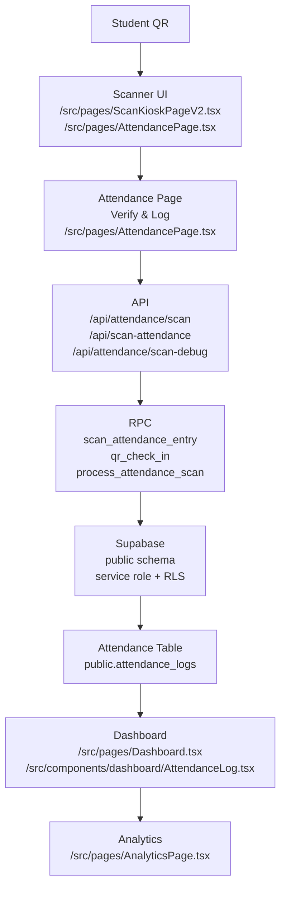

# Attendance System Forensic Report

Scope: reverse-engineering only. No fixes were applied while producing this report.

This document reconstructs the Attendance, QR, Student ID, Check-In, Check-Out, Verification, Dashboard, API, RPC, Supabase, and Device Scanner systems from the checked-in code, migrations, and generated Supabase types.

## Section 1. System Architecture Map

### End-to-end architecture

### Step-by-step map

| Step | File name | Function / component | Route | Database table | RPC function |
|---|---|---|---|---|---|
| Student QR generation | `src/lib/studentQr.ts` | `signStudentQrToken`, `createStudentQrClaims`, `buildStudentQrRouteValue` | `/api/student-qr` when tokens are requested server-side | `students` | `get_student_id_profile` feeds student selection, `studentQr.server.ts` signs the token |
| Student ID display | `src/pages/StudentIdProfilePage.tsx`, `src/pages/QRCodesPage.tsx`, `src/components/dashboard/StudentQRCard.tsx`, `src/components/studentCard/StudentIdCard.tsx` | page components and QR card renderers | page routes from the app router | `students` | `get_student_id_profile` |
| Scanner UI | `src/pages/ScanKioskPageV2.tsx`, `src/lib/scan/ScanController.ts`, `src/lib/scan/CameraService.ts`, `src/lib/scan/ScannerEngine.ts` | `ScanKioskPageV2`, `ScanController` | `/scan` | `entry_devices`, `attendance_logs`, `library_access_keys` | indirect, via `/api/attendance/scan` |
| Attendance page | `src/pages/AttendancePage.tsx` | `AttendancePage`, `handleSubmit`, `checkInMutation`, `resolveCheckInRpcArgs` | `/dashboard/attendance` | `students`, `attendance_logs` | `qr_check_in` |
| API layer | `server/vercelHandler.ts`, `api/attendance/[...route].ts`, `api/scan-attendance.ts`, `api/device-setup.ts`, `api/device-heartbeat.ts` | route dispatch | `/api/attendance/scan`, `/api/scan-attendance`, `/api/attendance/scan-debug`, `/api/device-setup`, `/api/device-heartbeat`, `/api/student-qr` | all attendance tables | `scan_attendance_entry`, `qr_check_in`, `process_attendance_scan`, `validate_and_bind_scanner_device`, `resolveDeviceHeartbeatRequest`, `resolveStudentQrSigningRequest` |
| RPC / database | `src/lib/scanAttendance.server.ts`, `supabase/functions/scan-attendance/index.ts` | `resolveScanAttendanceRequest`, `resolveScanAttendanceDebugRequest` | API routes above | `students`, `attendance_logs`, `entry_devices`, `library_access_keys`, `library_subscriptions` | `scan_attendance_entry`, `qr_check_in`, `process_attendance_scan`, `log_attendance_failure` |
| Dashboard | `src/pages/Dashboard.tsx`, `src/components/dashboard/AttendanceLog.tsx`, `src/components/dashboard/ScannerOperationsPanel.tsx` | dashboard queries and realtime subscription | `/dashboard` and subpanels | `attendance_logs`, `students`, `payments`, `entry_devices` | none directly on the read path |
| Analytics | `src/pages/AnalyticsPage.tsx` | analytics query composition | `/dashboard/analytics` | `students`, `payments`, `time_slots` | none directly |

### How the layers connect

1. A student ID is created in `public.students`.
2. QR output is rendered either as a legacy raw `qr_code` or as a signed JWT-like token generated on demand.
3. The scanner UI at `/scan` uses camera decoding and payload parsing before it sends a scan request to the API.
4. The Attendance page at `/dashboard/attendance` can also parse QR values locally and directly call the `qr_check_in` RPC.
5. The API route `/api/attendance/scan` is the main kiosk path. It validates device binding, library access, subscription state, and QR payload before calling RPCs.
6. The RPC attempts write attendance into `public.attendance_logs`.
7. The dashboard reads `attendance_logs` directly and uses realtime updates.
8. Analytics uses `students` and related business tables; it does not appear to write attendance, but attendance outcomes influence dashboard state and operational visibility.

## Section 2. QR Flow

### QR lifecycle

1. Student ID creation
   - Primary source of truth: `public.students`.
   - Key fields: `id`, `library_id`, `qr_code`, `status`, `expiry_date`, `last_check_in`, `seat_number`, `slot_id`, `phone`, `full_name`.

2. QR generation
   - Server-side signer: `src/lib/studentQr.server.ts` -> `resolveStudentQrSigningRequest`.
   - Token creation: `src/lib/studentQr.ts` -> `createStudentQrClaims` + `signStudentQrToken`.
   - Browser-facing helpers:
     - `src/api/studentQr.ts` -> `fetchSignedStudentQrTokensSafe`
     - `src/lib/deviceKiosk.ts` -> `buildStudentQrValue`
     - `src/pages/StudentIdProfilePage.tsx`
     - `src/pages/QRCodesPage.tsx`

3. QR storage
   - Legacy QR is stored in `public.students.qr_code`.
   - Signed QR tokens are not stored as a persistent DB field in the checked-in schema. They are generated on demand and rendered into a QR code payload.
   - Device-local storage stores kiosk binding, not the QR itself:
     - `localStorage.library_id`
     - `localStorage.library_access_key`

4. QR verification
   - Browser-side verification:
     - `src/lib/studentQr.ts` -> `parseStudentQrPayload`, `verifyStudentQrToken`
     - `src/pages/AttendancePage.tsx`
     - `src/pages/ScanKioskPageV2.tsx`
   - Server-side verification:
     - `src/lib/scanAttendance.server.ts`
     - `supabase/functions/scan-attendance/index.ts`

5. QR parsing
   - Supported payload shapes:
     - Signed JWT token
     - Legacy raw QR string
     - Structured JSON `{ studentId, libraryId }`
     - Student route URL `/student/<token>?library_id=...`
   - Parser entry point:
     - `src/lib/studentQr.ts` -> `parseStudentQrPayload`
     - `src/lib/deviceKiosk.ts` delegates to the same parser

6. QR signing
   - Signing algorithm: RS256.
   - Token claims:
     - `typ = libriofy.student_qr`
     - `version = 1`
     - `student_id`
     - `library_id`
     - `exp`
     - `iat`
     - `nonce`

7. JWT generation
   - Generated by `src/lib/studentQr.ts` -> `signStudentQrToken`.
   - Protected by the private key loaded from environment configuration in `studentQr.server.ts` and debug scanning paths.

8. JWT validation
   - `src/lib/studentQr.ts` -> `verifyStudentQrToken`
   - Validation checks:
     - JWT structure
     - header alg `RS256`
     - header typ `JWT`
     - signature correctness
     - expiration
     - expected library match

### Which file does what

| Function | File | Role |
|---|---|---|
| Generates QR token | `src/lib/studentQr.ts` | `signStudentQrToken` |
| Creates claim payload | `src/lib/studentQr.ts` | `createStudentQrClaims` |
| Reads QR | `src/lib/studentQr.ts`, `src/lib/deviceKiosk.ts`, `src/pages/AttendancePage.tsx`, `src/pages/ScanKioskPageV2.tsx` | `parseStudentQrPayload` |
| Validates QR signature | `src/lib/studentQr.ts` | `verifyStudentQrToken` |
| Chooses QR display value | `src/lib/deviceKiosk.ts`, `src/lib/studentQr.ts` | `buildStudentQrValue`, `buildStudentQrRouteValue` |
| Stores legacy QR field | `public.students.qr_code` | database field |

### Legacy QR flow

Legacy mode is the older path where the QR string itself is the student identifier or a stable QR code string:

1. `students.qr_code` stores the raw QR value.
2. Scanner reads the raw string.
3. `parseStudentQrPayload(..., { allowLegacy: true })` accepts it without signature verification.
4. Attendance RPC receives `p_qr_code` or a resolved `p_student_id`.

Legacy flow is still supported in:
- `src/pages/AttendancePage.tsx`
- `src/pages/ScanKioskPageV2.tsx`
- `src/lib/scanAttendance.server.ts`

### Signed QR flow

Signed QR is the current hardened path:

1. Server signs token with RS256.
2. QR card renders the token or a student URL wrapping the token.
3. Scanner decodes the payload.
4. `parseStudentQrPayload` verifies the token and extracts `studentId` and `libraryId`.
5. The scan service looks up the student by ID instead of trusting the raw QR string.
6. Attendance write proceeds only after device, library, and subscription checks pass.

## Section 3. Attendance Flow

### Verify & Log button flow

The `Verify & Log` button is in `src/pages/AttendancePage.tsx`.

#### Click to write

1. User enters or scans a QR value in the input.
2. `handleSubmit` calls `parseStudentQrPayload` with:
   - `allowLegacy: true`
   - `expectedLibraryId: resolvedLibraryId ?? readStoredLibraryId()`
   - `publicKeyPem: STUDENT_QR_PUBLIC_KEY`
3. If parsing fails, the UI shows denial and stops.
4. If parsing succeeds:
   - legacy payload -> `{ source: "legacy", qrCode }`
   - structured payload -> `{ source: "structured", studentId, libraryId }`
   - signed payload -> `{ source: "signed", studentId }`
5. `checkInMutation.mutate(checkInTarget)` fires.
6. `checkInMutation` calls `supabase.rpc("qr_check_in", { ...rpcArgs, p_library_id: resolvedLibraryId })`.
7. The RPC result updates the UI and invalidates:
   - `attendance-logs-today`
   - `dashboard-overview`
8. The dashboard log component refetches and realtime updates follow.

#### UI -> service -> API -> RPC -> DB

| Layer | File / function | What it does |
|---|---|---|
| UI | `src/pages/AttendancePage.tsx` -> `handleSubmit` | accepts manual input or camera scan |
| Client verification | `src/lib/studentQr.ts` -> `parseStudentQrPayload` | validates signed vs legacy QR locally |
| RPC preparation | `src/pages/AttendancePage.tsx` -> `resolveCheckInRpcArgs` | converts parsed payload to `p_student_id` or `p_qr_code` |
| RPC call | `src/pages/AttendancePage.tsx` -> `supabase.rpc("qr_check_in", ...)` | writes attendance through Supabase |
| DB write | `public.attendance_logs` | check-in / check-out record is updated or created |
| Read-back | `src/components/dashboard/AttendanceLog.tsx`, `src/pages/Dashboard.tsx` | displays today’s attendance and dashboard metrics |

### Kiosk attendance flow

`/scan` takes the same core data path, but with more device hardening.

1. `ScanKioskPageV2` boots `ScanController` and camera access.
2. `ScanController` detects QR frames.
3. `parseStudentQrPayload` verifies the payload with `QR_PUBLIC_KEY`.
4. The kiosk checks local binding:
   - `readStoredLibraryId()`
   - `readStoredLibraryAccessKey()`
5. The kiosk generates a queue entry using `createAttendanceQueueEntry`.
6. If online, it sends the entry with `submitAttendanceScanDetailed`.
7. The API route `/api/attendance/scan` or `/api/scan-attendance` runs `resolveScanAttendanceRequest`.
8. On success, the kiosk updates UI state and local offline cache.
9. On network failure, the entry is saved to IndexedDB and retried via `syncQueuedAttendance`.

### Check-In logic

Observed check-in behavior:

- On the attendance page, `qr_check_in` can be called with either `p_student_id` or `p_qr_code`.
- On the kiosk path, `scan_attendance_entry` is preferred, then `qr_check_in`, then legacy `qr_check_in`.
- The database logic historically inserts into `attendance_logs` when a student is not already inside, then updates `students.last_check_in` and resets `no_show_days`.

### Check-Out logic

Check-out is part of the same attendance RPC family.

- The attendance UI normalizes the action returned by the RPC as either `check-in` or `check-out`.
- `attendance_logs.check_out` is populated when the record is closed.
- Dashboard renderers consider a row "Completed" when `check_out` is non-null.

### Duplicate scan logic

- Client duplicate protection:
  - `ScanKioskPageV2` blocks repeat scans for the same student within `DUP_WINDOW_MS = 3000`.
- Server duplicate protection:
  - The RPC family can return `duplicate: true`.
  - The kiosk treats duplicate success as a warning state instead of a fresh write.
- Dashboard duplication behavior:
  - `attendance_logs` is read in descending `check_in` order for today, so duplicate events are easy to spot operationally.

### Invalid QR logic

- Browser-side parse failure returns:
  - `INVALID_QR`
  - `WRONG_LIBRARY`
  - `EXPIRED`
  - `SIGNATURE_INVALID`
- Server-side scan failure also logs denial and route metadata into `log_attendance_failure`.

### Expired membership logic

Expiration can stop attendance at multiple layers:

1. QR signing eligibility
   - `src/lib/studentQr.ts` -> `shouldUseSignedStudentQrToken`
   - `src/lib/studentMembership.ts` -> `isStudentCurrentlyActive`
2. Attendance verification
   - `src/lib/scanAttendance.server.ts` checks subscription state and student eligibility.
3. Student status drift guard
   - `supabase/migrations/20260602090000_student_membership_status_guard.sql` backfills and keeps status consistent.

## Section 4. Database Forensics

### `students`

Purpose:
- Primary student identity and membership record.
- Source for QR identity, student status, seat, slot, and attendance eligibility.

Columns observed in generated types:
- `id`
- `library_id`
- `user_id`
- `full_name`
- `phone`
- `email`
- `plan`
- `plan_id`
- `seat_number`
- `seat_id`
- `slot`
- `slot_id`
- `status`
- `qr_code`
- `start_date`
- `expiry_date`
- `no_show_days`
- `last_check_in`
- `notes`
- `address`
- `gender`
- `aadhaar_number`
- `aadhaar_photo_path`
- `photo_storage_path`
- `photo_thumbnail_path`
- `photo_url`
- `photo_version`
- `archived_at`
- `created_at`
- `updated_at`

Relationships:
- `students.library_id -> libraries.id`
- `students.plan_id -> plans.id`
- `students.seat_id -> seats.id`
- `students.slot_id -> time_slots.id`

Triggers:
- `update_students_updated_at`
- `a_sync_student_membership_status_before_write`
- `sync_student_membership_status_before_write` is dropped and replaced by the above in later migrations.

Indexes:
- `idx_students_library`
- `idx_students_qr`
- `idx_students_status`
- `idx_students_plan_id`
- `idx_students_slot_id`
- `idx_students_seat_id`
- `idx_students_library_qrcode`
- `idx_students_library_id`
- `idx_students_library_status_expiry_date`

Notes:
- This table is the primary QR lookup table for both legacy and signed QR flows.
- `students.qr_code` is the legacy QR storage field.

### `attendance_logs`

Purpose:
- Attendance event ledger.
- Stores check-in/check-out lifecycle for a student within a library.

Columns observed in generated types:
- `id`
- `student_id`
- `library_id`
- `check_in`
- `check_out`
- `date`
- `entry_id`
- `device_id`
- `created_at`

Relationships:
- `attendance_logs.library_id -> libraries.id`
- `attendance_logs.student_id -> students.id`

Triggers:
- No dedicated trigger was confirmed in the checked-in migrations for this table beyond the attendance processing routines.

Indexes:
- `idx_attendance_student`
- `idx_attendance_date`
- `idx_attendance_logs_entry_id`
- `idx_attendance_logs_device_id`
- `idx_attendance_logs_library_date`
- `idx_attendance_logs_student_date`

Notes:
- The dashboard and kiosk systems read this table heavily.
- Realtime subscriptions are configured on this table in `AttendanceLog.tsx`.

### `library_access_keys`

Purpose:
- Library-level access token registry used by device setup and heartbeat validation.

Columns observed in generated types:
- `library_id`
- `access_key`
- `created_at`
- `updated_at`
- `rotated_at`

Relationships:
- `library_access_keys.library_id -> libraries.id`

Triggers:
- `update_library_access_keys_updated_at`

Indexes:
- `idx_library_access_keys_access_key`

Notes:
- Format validation is enforced by `normalizeLibraryAccessKey` plus the database constraint in migration history.
- Kiosk setup uses this table as the primary gate before binding `entry_devices`.

### `renewals`

Status in checked-in repo:
- No local `CREATE TABLE public.renewals` definition was found in the reviewed migrations or generated types.
- The attendance runtime integrity migration explicitly checks for `public.renewals`.

What this means:
- The application expects the table at runtime.
- Because no local schema definition was found, this report does not invent columns or triggers.

Observed references:
- `src/lib/attendanceRuntimeIntegrity.server.ts`
- `supabase/migrations/20260523170000_attendance_runtime_integrity.sql`
- renewal workflows in other parts of the system

### `student_ids`

Status in checked-in repo:
- No local `CREATE TABLE public.student_ids` definition was found in the reviewed migrations or generated types.
- Student ID delivery is modeled in the code through `students`, signed QR tokens, and delivery jobs rather than a dedicated `student_ids` table in the checked-in schema snapshot.

What this means:
- If a deployed environment has a `student_ids` table, it is not present in the local schema snapshot reviewed for this report.
- The safer forensic assumption is that the codebase has migrated away from a dedicated `student_ids` table or never checked it in here.

## Section 5. RPC Audit

### Attendance RPCs

#### `qr_check_in`

Signatures in generated types:

1. `{ p_library_id: string; p_qr_code: string } -> Json`
2. `{ p_entry_id?: string; p_entry_timestamp?: string; p_library_id: string; p_qr_code: string } -> Json`
3. `{ p_device_id?: string; p_entry_id?: string; p_entry_timestamp?: string; p_library_id?: string; p_qr_code?: string; p_student_id?: string } -> Json`

Observed migration source cluster:
- `supabase/migrations/20260228060018_300b3a78-39aa-44e1-b17d-6c96877cacbe.sql`
- `supabase/migrations/20260401123000_offline_first_attendance_queue.sql`
- `supabase/migrations/20260401160000_signed_qr_multi_device_security.sql`
- `supabase/migrations/20260401170000_secure_attendance_data_lock.sql`
- `supabase/migrations/20260404113000_phonepe_qr_attendance_toggle.sql`

Behavior:
- Legacy attendance.
- Modern signed QR attendance.
- Device-aware attendance.
- Can return check-in, check-out, or duplicate status.

#### `scan_attendance_entry`

Signatures in generated types:

1. `{ p_library_id: string; p_qr_code: string } -> Json`
2. `{ p_entry_id?: string; p_entry_timestamp?: string; p_library_id: string; p_qr_code: string } -> Json`
3. `{ p_device_id?: string; p_entry_id?: string; p_entry_timestamp?: string; p_library_id?: string; p_qr_code?: string; p_student_id?: string } -> Json`

Observed migration source cluster:
- `supabase/migrations/20260401160000_signed_qr_multi_device_security.sql`
- `supabase/migrations/20260401170000_secure_attendance_data_lock.sql`
- `supabase/migrations/20260404113000_phonepe_qr_attendance_toggle.sql`

Behavior:
- Preferred kiosk scan RPC.
- Called first by `resolveScanAttendanceRequest`.
- Falls back to `qr_check_in` when missing or not available in the deployed schema.

#### `process_attendance_scan`

Signature:
- `{ p_failure_route: string; p_student_id?: string; p_qr_code?: string; p_library_id?: string; p_device_id?: string; p_entry_id?: string; p_entry_timestamp?: string } -> Json`

Observed migration source:
- `supabase/migrations/20260404113000_phonepe_qr_attendance_toggle.sql`

Behavior:
- Wrapper used in later attendance logic.
- Delegates to the underlying attendance processing route family.

#### `log_attendance_failure`

Signature:
- `{ p_code: string; p_message: string; p_metadata?: Json; p_route: string; p_source?: string } -> undefined`

Observed migration source:
- attendance observability migrations

Behavior:
- Stores attendance route failures for diagnostics and support.

### Other RPCs related to this system

#### `get_student_id_profile`

Signatures:
- `{ p_qr_code: string } -> Json`
- `{ p_library_id?: string; p_qr_code?: string; p_student_id?: string } -> Json`

Usage:
- Student profile pages and student card generation.

#### `validate_and_bind_scanner_device`

Signature in generated types:
- `{ p_device_id?: string; p_library_access_key: string } -> Json`

Usage:
- `/setup-device`
- Browser page: `src/pages/SetupDevicePage.tsx`

Note:
- The local checked-in migrations reviewed in this audit did not expose a matching migration source for this RPC even though the generated types do.

#### `pull_device_commands`

Signature:
- `{ p_device_id: string; p_device_token: string; p_library_access_key: string; p_library_id: string; p_limit?: number } -> device_commands[]`

Usage:
- Scanner fleet command polling.

#### `record_device_command_status`

Signature:
- `{ p_command_id: string; p_device_id: string; p_device_token: string; p_error_message?: string; p_library_access_key: string; p_library_id: string; p_metadata?: Json; p_status: string } -> device_commands`

Usage:
- Device command acknowledgement and result reporting.

### Duplicate detection

Observed duplication clusters:

- `qr_check_in`
- `scan_attendance_entry`
- `get_student_id_profile`
- `process_renewals`
- `process_library_subscription_renewals`
- `process_locker_renewals`

Why duplicates exist:
- The attendance RPC family was evolved across multiple migrations.
- Each migration introduced either:
  - a new overload,
  - a wrapper function,
  - or a replacement implementation that preserved the function name.

Why `PGRST203` occurred

Inference based on checked-in code:
- The repo does not contain a literal `PGRST203` handler.
- The code does handle missing RPC/schema-cache cases using `PGRST202` and table-missing cases using `PGRST205`-style logic.
- The most likely real-world cause of a `PGRST203`-type failure here is PostgREST schema cache or overload resolution drift after deploying new overloads for `qr_check_in` and `scan_attendance_entry`.
- The duplicated function family increases the odds that a client and deployed database disagree on which signature exists.

Duplicate function examples worth checking in a live incident:
- `qr_check_in` legacy vs modern vs device-aware overloads
- `scan_attendance_entry` legacy vs modern vs device-aware overloads
- `get_student_id_profile` legacy QR lookup vs student-aware lookup

## Section 6. Scan Kiosk System

### `/scan`

Route:
- `/scan` maps to `src/pages/ScanKioskPageV2.tsx`

Frontend files:
- `src/pages/ScanKioskPageV2.tsx`
- `src/lib/scan/ScanController.ts`
- `src/lib/scan/CameraService.ts`
- `src/lib/scan/ScannerEngine.ts`
- `src/lib/deviceKiosk.ts`
- `src/lib/attendanceSync.ts`
- `src/lib/deviceHeartbeat.ts`
- `src/lib/scanDenial.ts`

Backend files:
- `server/vercelHandler.ts`
- `src/lib/scanAttendance.server.ts`
- `src/lib/deviceSetup.server.ts`
- `src/lib/deviceHeartbeat.server.ts`
- `supabase/functions/scan-attendance/index.ts`

Database tables:
- `entry_devices`
- `library_access_keys`
- `attendance_logs`
- `device_setup_attempts`
- `library_subscriptions`
- `students`

### Camera initialization

`ScanController` and the page component together handle:
- camera permission requests
- video element attachment
- retry and pause/resume states
- torch support
- decode worker lifecycle

Key camera-related behaviors from `ScanKioskPageV2.tsx`:
- `ScanController` is created on mount.
- `boot()` waits for the video element, attaches it, calls `init()`, then `start("page-load")`.
- `onDetect` passes raw QR payloads into the attendance pipeline.

### QR scanner

Scanner input path:
1. Frame detection in `ScanController`.
2. QR parsing via `parseStudentQrPayload`.
3. Library/device lookup with `readStoredLibraryId()` and `readStoredLibraryAccessKey()`.
4. Queue entry creation.
5. Live submission or offline queue save.

### Heartbeat

Heartbeat behavior:
- Every `HEARTBEAT_MS = 30000`
- Calls `sendDeviceHeartbeat`
- Includes:
  - `deviceId`
  - `libraryId`
  - `libraryAccessKey`
  - status fields like `appVersion`, `cameraReady`, `isOnline`, `lastSyncAt`, `pendingCount`, `phase`

Server heartbeat path:
- `/api/device-heartbeat`
- `src/lib/deviceHeartbeat.server.ts` -> `resolveDeviceHeartbeatRequest`

### Device registration

Setup path:
- `/setup-device`
- `src/pages/SetupDevicePage.tsx`
- RPC: `validate_and_bind_scanner_device`
- DB tables:
  - `library_access_keys`
  - `entry_devices`
  - `device_setup_attempts`

### Attendance submission

Submission path from kiosk:
1. QR is parsed and validated locally.
2. `createAttendanceQueueEntry` generates a durable entry id.
3. If online:
   - `submitAttendanceScanDetailed` POSTs to `/api/attendance/scan` or `/api/scan-attendance`
4. If offline or fetch fails:
   - `enqueueAttendanceQueueEntry` writes to IndexedDB store `libriofy-attendance-queue`
5. Background sync later calls `syncQueuedAttendance`

Fallback chain on the server:
1. `scan_attendance_entry`
2. `qr_check_in` modern overload
3. `qr_check_in` legacy overload

## Section 7. Known Issues

Severity ranking based on the checked-in code and migration history.

### Critical

1. RPC overload drift for attendance writes
   - Impact: kiosk and browser clients can fail to resolve `qr_check_in` or `scan_attendance_entry`.
2. Device binding mismatch
   - Impact: scanner cannot submit attendance until `/setup-device` is repaired.
3. Subscription block on scan path
   - Impact: scanning can be hard-stopped when `library_subscriptions` is expired or failed.

### High

1. Duplicate function history across attendance RPCs
   - Impact: schema cache mismatch and overload confusion.
2. Signed QR key mismatch
   - Impact: valid-looking QR becomes invalid if the browser/server public key is stale.
3. Offline queue sync failure
   - Impact: attendance silently queues and does not reach Supabase until sync recovers.
4. Heartbeat 404 or validation failure
   - Impact: kiosk appears connected but is actually out of policy or unbound.

### Medium

1. Membership drift
   - Impact: `students.status` and `expiry_date` can disagree with active membership logic until the guard migration corrects it.
2. Route conflicts between `/api/scan-attendance` and `/api/attendance/scan`
   - Impact: deployment routing differences can hide one of the paths.
3. Realtime dashboard lag
   - Impact: attendance appears late until `AttendanceLog` refetch or realtime subscription catches up.

### Low

1. Camera startup friction
   - Impact: browser permission or device enumeration failures.
2. Debug panel noise
   - Impact: low-severity operational clutter, but useful during incidents.
3. Analytics not reading attendance directly
   - Impact: dashboard and analytics can feel disconnected during investigations.

### Issue category matrix

| Area | Observed risk |
|---|---|
| Deployment issues | API route divergence, serverless environment variable mismatches |
| Supabase issues | schema cache, RLS, missing RPC overloads, missing runtime tables |
| RPC conflicts | duplicate `qr_check_in` and `scan_attendance_entry` signatures |
| Route conflicts | `/api/scan-attendance` vs `/api/attendance/scan` |
| Membership drift | `students.status`, `expiry_date`, and runtime subscription state can disagree |
| Scanner failures | camera permissions, decode failures, torch issues |
| Heartbeat failures | invalid access key, inactive device, library mismatch |
| Attendance failures | invalid QR, expired membership, duplicate scan, RPC failure |

## Section 8. Live Debugging Guide

### `INVALID_QR`

Symptoms:
- Scanner shows denied result.
- Attendance page shows "Access Denied" with invalid ID.

Root cause:
- Bad payload, malformed token, wrong library, expired signed QR, or signature failure.

Logs to inspect:
- Browser console
- kiosk debug panel
- server `scan-debug` response

Tables to inspect:
- `students`
- `attendance_logs`

RPC to inspect:
- `scan_attendance_entry`
- `qr_check_in`
- `get_student_id_profile`

Fix approach:
- Verify public key, library ID, and QR payload shape.
- Confirm the student exists and is active.

### `SUBSCRIPTION_EXPIRED`

Symptoms:
- Scanner refuses to write attendance.
- Debug stages show subscription check error.

Root cause:
- `library_subscriptions.status` or `payment_status` is expired/cancelled/failed.

Logs to inspect:
- `log_attendance_failure`
- server attendance debug stages

Tables to inspect:
- `library_subscriptions`
- `students`

RPC to inspect:
- `get_attendance_runtime_diagnostics`
- renewal processors

Fix approach:
- Renew the library subscription and refresh cached runtime state.

### `DEVICE_BLOCKED`

Symptoms:
- Setup page or scanner says device is blocked.

Root cause:
- Invalid device token, inactive device, disabled control metadata, or setup lockout.

Logs to inspect:
- `device_setup_attempts`
- `entry_devices.metadata.device_control`
- attendance failure logs

Tables to inspect:
- `entry_devices`
- `device_setup_attempts`
- `library_access_keys`

RPC to inspect:
- `validate_and_bind_scanner_device`
- `pull_device_commands`
- `record_device_command_status`

Fix approach:
- Rebind the device or clear the failed setup state.

### `WRONG_LIBRARY`

Symptoms:
- Device or QR verification says the library is wrong.

Root cause:
- Device or QR belongs to another library.

Logs to inspect:
- scan debug response
- heartbeat failure logs

Tables to inspect:
- `students`
- `entry_devices`
- `library_access_keys`

RPC to inspect:
- `scan_attendance_entry`
- `qr_check_in`
- `validate_and_bind_scanner_device`

Fix approach:
- Regenerate the proper library access key, rebind the kiosk, or issue a QR for the correct library.

### `duplicate scan`

Symptoms:
- Success result says already marked.
- Kiosk emits warning tone or "Already Marked".

Root cause:
- Same student scanned within a short window or same attendance open record already exists.

Logs to inspect:
- kiosk history panel
- RPC payload debug

Tables to inspect:
- `attendance_logs`

RPC to inspect:
- `scan_attendance_entry`
- `qr_check_in`

Fix approach:
- Confirm whether the student is already checked in and whether `check_out` is missing.

### `heartbeat 404`

Symptoms:
- Kiosk says reconnect or route not found.
- Device appears online but fails policy sync.

Root cause:
- Route not deployed, environment path mismatch, or API host issue.

Logs to inspect:
- browser network tab
- server logs for `/api/device-heartbeat`

Tables to inspect:
- `entry_devices`
- `library_access_keys`

RPC to inspect:
- none directly, but `validate_and_bind_scanner_device` and device heartbeat path are relevant.

Fix approach:
- Confirm deployment exposes `/api/device-heartbeat` and the client points at the same host.

### `PGRST203` / RPC conflict

Symptoms:
- Attendance write fails on Supabase RPC invocation.
- Client sees schema-cache or function resolution error.

Root cause:
- Overloaded function mismatch, deployed schema not refreshed, or one environment has a different RPC signature set.

Logs to inspect:
- server attendance debug output
- Supabase logs
- deployment logs

Tables to inspect:
- not table-first; inspect RPC definitions first

RPC to inspect:
- `qr_check_in`
- `scan_attendance_entry`
- `process_attendance_scan`

Fix approach:
- Reconcile deployed function signatures with checked-in migrations.
- Refresh schema cache and eliminate accidental overload drift.

### `camera failure`

Symptoms:
- `/scan` cannot open camera or keeps pausing.

Root cause:
- Permission denied, no camera, busy camera, or unsupported browser APIs.

Logs to inspect:
- browser console
- scanner debug log copy

Tables to inspect:
- none

RPC to inspect:
- none

Fix approach:
- Re-test on a browser with camera permission and a supported secure context.

## Section 9. Observability

### Browser Console

Use for:
- QR parse events
- scanner boot issues
- camera errors
- attendance submit timing
- offline queue sync failures

What to look for:
- `[scan] QR detected`
- `[scan] Parse result`
- API submission failures
- camera permission errors

### Network Tab

Use for:
- `/api/attendance/scan`
- `/api/attendance/scan-debug`
- `/api/device-heartbeat`
- `/api/device-setup`
- `/api/student-qr`

What to inspect:
- request payload
- response status
- response body
- retry / offline behavior

### API Logs

Use for:
- `server/vercelHandler.ts`
- serverless route failures
- route dispatch mismatch

What to inspect:
- `logAttendanceFailure`
- request IDs
- debug stages

### Supabase Logs

Use for:
- RPC execution failures
- schema cache issues
- permission / RLS failures
- table-missing or column-missing failures

### Database Queries

Use for:
- verifying a student record
- checking the attendance ledger
- verifying device binding
- checking subscription status

### GitHub Actions

Use for:
- verifying migrations ran
- catching build or type generation drift
- checking deployed environment parity

### Vercel Deployments

Use for:
- route presence
- environment variable consistency
- serverless function output
- runtime path mismatches

## Section 10. Root Cause History

This timeline is reconstructed from the codebase and migration history, not from incident tickets.

### Scan page crash

- Root cause:
  - camera or scanner lifecycle failure, often due to permission or unsupported API issues.
- Fix:
  - `ScanController` lifecycle hardening and defensive camera handling.
- Verification:
  - `/scan` starts camera, decodes a QR, and updates the UI history.

### Expired QR verification

- Root cause:
  - signed token expiration or membership ineligibility.
- Fix:
  - `verifyStudentQrToken` expiration check and active-student eligibility gate.
- Verification:
  - expired tokens fail with `EXPIRED`, active students generate valid tokens.

### Membership status drift

- Root cause:
  - `students.status` diverged from actual expiry logic.
- Fix:
  - `a_sync_student_membership_status_before_write` in the student membership guard migration.
- Verification:
  - active/expired state aligns with membership checks and runtime diagnostics.

### Invalid API key

- Root cause:
  - bad `library_access_key`, device token, or missing binding.
- Fix:
  - device setup and heartbeat validation against `library_access_keys` and `entry_devices`.
- Verification:
  - successful kiosk bind followed by successful heartbeat and scan.

### Deployment failure

- Root cause:
  - route or environment mismatch between client and deployed API.
- Fix:
  - align `/api/attendance/scan`, `/api/scan-attendance`, `/api/device-heartbeat`, `/api/device-setup`, `/api/student-qr`.
- Verification:
  - all routes respond on the deployed host and the scanner can submit attendance.

### Device heartbeat 404

- Root cause:
  - route missing or deployment mismatch.
- Fix:
  - deploy the heartbeat endpoint and ensure the kiosk points at the correct URL.
- Verification:
  - heartbeat returns `valid: true` and updates `entry_devices.last_seen_at`.

### PGRST203 RPC conflict

- Root cause:
  - overloaded attendance RPCs drifting out of sync with the schema cache.
- Fix:
  - unify migration history and refresh the deployed schema state.
- Verification:
  - attendance RPC resolves on the first try with no overload fallback needed.

## Section 11. System Health Score

Scores are forensic estimates based on the checked-in implementation, not live production telemetry.

| Area | Score / 10 | Rationale |
|---|---:|---|
| Attendance | 7 | Strong end-to-end path, but overloaded RPCs and fallback logic show complexity |
| Scanner | 7 | Good local parsing and offline handling, but camera/browser dependency remains sensitive |
| Database | 6 | Core tables are sound, but runtime integrity checks reveal missing or drifting pieces |
| API | 7 | Clear route map, but multiple attendance entry points create operational risk |
| Deployment | 6 | Vercel and serverless paths exist, but route parity is a known risk surface |
| QR Verification | 8 | Signed QR support is present and robust, with legacy fallback for compatibility |
| Student IDs | 7 | Solid student model and card generation, though legacy QR storage still exists |
| Renewals | 6 | Renewal logic is extensive, but runtime/table presence is uneven in the reviewed snapshot |

## Section 12. Recommendations

### Immediate fixes

1. Standardize the attendance RPC call surface.
2. Verify that deployed Supabase schema signatures match the checked-in overload set.
3. Confirm `/api/attendance/scan` and `/api/scan-attendance` resolve identically in every environment.
4. Recheck `STUDENT_QR_PUBLIC_KEY` / `STUDENT_QR_PRIVATE_KEY` parity across all deployments.

### Short-term fixes

1. Add a single canonical attendance RPC wrapper and keep the legacy overloads only as compatibility shims.
2. Improve runtime diagnostics for function overload resolution.
3. Make the kiosk setup and heartbeat status easier to inspect from one admin screen.
4. Tighten DB integrity checks around `students.status`, `expiry_date`, and active membership.

### Long-term architecture improvements

1. Reduce attendance RPC overload count.
2. Introduce a clearer scan event contract with one canonical payload shape.
3. Separate "verify QR" from "write attendance" more explicitly.
4. Move QR issuance, device binding, and attendance write observability into one shared admin diagnostics surface.
5. Decide whether `students.qr_code` remains a compatibility field or becomes fully retired in favor of signed QR tokens.

## Appendix. RPC inventory observed in checked-in migrations

This list is derived from the local `supabase/migrations` directory and should be treated as the audited on-repo inventory.

- `add_to_waiting_list`
- `admin_approve_partner_payout`
- `admin_mark_partner_payout_paid`
- `apply_subscription_plan_snapshot`
- `assign_locker`
- `can_access_library`
- `claim_id_card_delivery_jobs`
- `confirm_waiting_list`
- `derive_student_original_photo_path`
- `detect_no_shows`
- `enqueue_partner_followup_notification`
- `ensure_library_subscription`
- `extract_student_photo_path_from_url`
- `extract_student_photo_version_from_url`
- `fanout_locker_notification`
- `fanout_operational_notification`
- `find_super_admin_by_email`
- `format_compact_time`
- `generate_affiliate_code`
- `generate_library_access_key_value`
- `generate_partner_code`
- `generate_referral_code`
- `get_attendance_runtime_diagnostics`
- `get_auth_runtime_status`
- `get_billing_runtime_diagnostics`
- `get_library_public`
- `get_partner_leaderboard`
- `get_schema_entity_status`
- `get_slot_availability`
- `get_student_id_profile`
- `get_student_photo_upload_diagnostics`
- `get_student_renewal_context`
- `handle_affiliate_commission_totals`
- `handle_coupon_redemption_notification`
- `handle_library_access_key_insert`
- `handle_library_acquisition_notification`
- `handle_library_locker_sync`
- `handle_library_seat_sync`
- `handle_library_signup_notification`
- `handle_new_user`
- `handle_partner_commission_notification`
- `handle_payment_notification_events`
- `handle_student_notification_events`
- `handle_student_renewal_payment_approval`
- `handle_support_ticket_notification_events`
- `has_role`
- `is_maintenance_mode_enabled`
- `is_student_photo_final_storage_path`
- `is_student_photo_temp_storage_path`
- `issue_device_command`
- `issue_library_access_key`
- `leads_apply_converted_defaults`
- `leads_set_default_followup`
- `library_locker_plan_limit`
- `library_seat_plan_limit`
- `locker_label_from_index`
- `log_attendance_failure`
- `log_student_photo_upload_failure`
- `normalize_lookup_text`
- `normalize_seat_number`
- `notification_category_for_event`
- `notifications_apply_defaults`
- `notify_library_users`
- `notify_next_in_queue`
- `notify_super_admins`
- `partner_notify_lead_status_change`
- `prepare_locker_write`
- `prepare_student_assignments`
- `prepare_student_photo_upload`
- `prevent_writes_during_maintenance`
- `process_attendance_scan`
- `process_library_subscription_renewals`
- `process_locker_renewals`
- `process_renewals`
- `process_subscription_payment_capture`
- `process_waiting_list_timeouts`
- `pull_device_commands`
- `qr_check_in`
- `queue_student_id_card_delivery_on_student_change`
- `recalculate_affiliate_totals`
- `record_device_command_status`
- `regenerate_library_access_key`
- `release_locker`
- `renew_student`
- `request_partner_payout`
- `resolve_app_error_library_id`
- `resolve_referral_click_partner`
- `resolve_supabase_edge_function_url`
- `run_renewal_reminder_scan`
- `scan_attendance_entry`
- `seat_label_from_index`
- `set_platform_settings_metadata`
- `slot_lookup_matches`
- `student_photo_storage_library_id`
- `submit_renewal_payment`
- `super_admin_verify_password`
- `sync_library_capacity_from_subscription`
- `sync_library_lockers`
- `sync_library_owner_name`
- `sync_library_seats`
- `sync_student_membership_status`
- `sync_subscription_plan_catalog_changes`
- `trigger_daily_renewal_reminder_scan`
- `trigger_pending_subscription_payment_reconciliation`
- `trigger_student_id_card_delivery_processing`
- `trigger_student_photo_cleanup`
- `update_student_photo_url`
- `update_updated_at_column`
- `upsert_student_id_card_delivery_job`
- `user_can_access_library`
- `validate_library_locker_capacity`
- `validate_library_seat_capacity`
