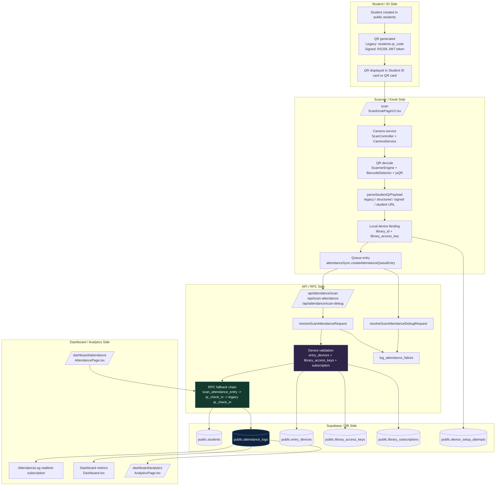

# Attendance Architecture Mermaid

## Route and function index

| Layer | File | Function / component | Route | Table | RPC |
|---|---|---|---|---|---|
| Student QR signing | `src/lib/studentQr.server.ts` | `resolveStudentQrSigningRequest` | `/api/student-qr` | `students` | `get_student_id_profile` for related student selection |
| Student QR parsing | `src/lib/studentQr.ts` | `parseStudentQrPayload`, `verifyStudentQrToken` | n/a | `students` | n/a |
| Attendance page verify | `src/pages/AttendancePage.tsx` | `handleSubmit`, `checkInMutation`, `resolveCheckInRpcArgs` | `/dashboard/attendance` | `students`, `attendance_logs` | `qr_check_in` |
| Scan kiosk | `src/pages/ScanKioskPageV2.tsx` | `process`, `heartbeat`, `sync`, `runManualDebugRequest` | `/scan` | `entry_devices`, `attendance_logs`, `library_access_keys` | `scan_attendance_entry`, `qr_check_in`, `process_attendance_scan` |
| Scan API | `src/lib/scanAttendance.server.ts` | `resolveScanAttendanceRequest`, `resolveScanAttendanceDebugRequest` | `/api/attendance/scan`, `/api/scan-attendance`, `/api/attendance/scan-debug` | `students`, `attendance_logs`, `entry_devices`, `library_access_keys`, `library_subscriptions` | `scan_attendance_entry`, `qr_check_in`, `process_attendance_scan`, `log_attendance_failure` |
| Device setup | `src/lib/deviceSetup.server.ts` | `validateAndBindScannerDevice` | `/api/device-setup` | `library_access_keys`, `entry_devices`, `device_setup_attempts` | `validate_and_bind_scanner_device` |
| Device heartbeat | `src/lib/deviceHeartbeat.server.ts` | `resolveDeviceHeartbeatRequest` | `/api/device-heartbeat` | `library_access_keys`, `entry_devices` | n/a |
| Dashboard reads | `src/pages/Dashboard.tsx` | dashboard query | `/dashboard` | `attendance_logs`, `students`, `payments` | n/a |
| Attendance realtime | `src/components/dashboard/AttendanceLog.tsx` | realtime subscription | dashboard panel | `attendance_logs` | n/a |
| Analytics reads | `src/pages/AnalyticsPage.tsx` | analytics query | `/dashboard/analytics` | `students`, `payments`, `time_slots` | n/a |

## Notes

1. The main operational write path is the kiosk API, not the dashboard page.
2. The dashboard is mostly read-only over `attendance_logs`.
3. Signed QR and legacy QR both remain supported, but the signed path is the hardened path.
4. The device setup and heartbeat routes are what keep `/scan` bound to the correct library and device.
