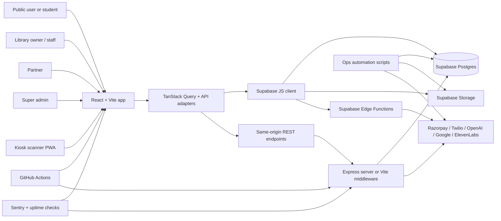

# Architecture Overview

## System Goal

Libriofy is designed as a full operating system for a study library, not just a dashboard. The platform combines:

- library onboarding
- student lifecycle management
- seat and locker assignment
- signed QR identity
- kiosk attendance
- payment and renewal management
- partner-led growth
- super admin governance

## Runtime Architecture

## Important Architectural Choice

Libriofy uses three backend access patterns in parallel:

1. Direct Supabase reads and safe writes from the browser for many dashboard features.
2. Custom REST endpoints for security-sensitive flows such as auth, signed QR issuance, scanner device setup, scanner heartbeat, and attendance validation.
3. Supabase Edge Functions for external-provider integrations and heavy automation such as billing, renewals, recovery calls, AI insights, and webhooks.

This is intentional. The system does not force every feature through one API layer.

## Main Entry Points

| Entry point | Responsibility |
| --- | --- |
| `src/App.tsx` | All route registration and route guards |
| `server/index.ts` | Express API surface for auth, scan, settings, AI partner helper, static app serving |
| `vite.config.ts` | Development-time API middlewares mirroring the Express endpoints |
| `src/hooks/useAuth.tsx` | Client auth state, refresh timers, inactivity handling, redirect behavior |
| `src/lib/otpAuth.server.ts` | Core auth business logic for OTP, email login, refresh tokens, super admin MFA |
| `src/lib/scanAttendance.server.ts` | Device validation, QR verification, attendance scan orchestration |
| `supabase/migrations/` | Actual backend schema and business-rule source of truth |
| `supabase/functions/` | External integrations and scheduled/webhook automation |

## Role Model

| Role | Where it comes from | Main access |
| --- | --- | --- |
| `public` | no login required | marketing site, public library page, renewal link, student profile link |
| `library_owner` | `user_roles` + signup bootstrap | all `/dashboard/*`, settings, QR, billing, waitlist |
| `staff` | `user_roles` | operational dashboard areas, attendance, students, payments |
| `partner` | `user_roles` or derived from `affiliates.user_id` | `/partner/*` |
| `super_admin` | `user_roles` plus MFA flow | `/admin/*` |
| `student` | represented mostly through public token links and QR identity, not a full dashboard role yet | `/renew/:token`, `/student/:qr` |

## Module Breakdown

| Module | Main routes | Purpose | Primary backend contract |
| --- | --- | --- | --- |
| Public marketing | `/`, `/about`, `/contact`, `/support`, `/terms`, `/privacy-policy` | Brand, lead capture, entry into signup/referral flows | Mostly static pages plus `contacts` table |
| Domain-aware library website | `/library/:slug` and custom domains | Public-facing library landing page with plans, slots, waiting list form | `get_library_public`, `get_slot_availability`, `add_to_waiting_list` |
| Authentication | `/auth`, `/login`, `/signup`, `/reset-password`, `/admin/login` | OTP login, email login, password reset, super admin MFA | `/auth/*`, `/api/auth/*`, Supabase Auth, `auth_trusted_devices`, `login_logs` |
| Library dashboard home | `/dashboard` | Live operations, revenue, attendance, device control, risk summaries | direct table reads, `DeviceControlCenter`, recovery views |
| Students | `/dashboard/students` | Create and manage students, photos, Aadhaar, seat and slot assignment | `students`, `student_slot_assignments`, storage, photo RPCs/functions |
| Seats and lockers | `/dashboard/seats`, `/dashboard/lockers` | Capacity planning and assignment | `seats`, `lockers`, `sync_library_seats`, `sync_library_lockers`, locker RPCs |
| Attendance | `/dashboard/attendance`, `/setup-device`, `/scan` | Dashboard scan history plus kiosk setup and live scanning | `/api/device-setup`, `/api/device-heartbeat`, `/api/attendance/scan`, `scan_attendance_entry`, `qr_check_in` |
| QR and ID cards | `/dashboard/qr-codes`, `/student/:qr` | Signed QR creation, printable ID cards, public student profile | `/api/student-qr`, signed token helpers, export utilities |
| Payments and renewals | `/dashboard/payments`, `/dashboard/renewals`, `/renew/:token` | Ledger, reminders, screenshot-based renewal proof, automation | `payments`, `reminder_logs`, `process-renewals`, `submit_renewal_payment` |
| Settings and website builder | `/dashboard/settings` | Library profile, branding, plans, slots, seat and locker capacity, public site customization | `libraries`, `plans`, `time_slots`, `library_gallery_images`, `library_access_keys` |
| Notifications and support | `/dashboard/notifications`, `/dashboard/support` | Alert center and ticketing | `notifications`, `support_tickets` |
| Partner portal | `/partner/*` | Partner onboarding, CRM, commissions, payouts, AI sales support | `affiliates`, `leads`, `affiliate_commissions`, `payouts`, `/api/ai/partner` |
| Super admin | `/admin/*` | Platform governance, subscriptions, growth intelligence, domains, payouts | admin views, `admin-libraries` function, analytics views, AI functions |
| Operational resilience | scheduled jobs, backup verification, restore drills, alerts | predictable backup, restore, and monitoring workflow | `scripts/backup-db.ps1`, `scripts/restore-db.ps1`, `scripts/run-restore-drill.ps1`, `scripts/monitor-backup-health.ps1` |
| DevOps and observability | CI/CD, health probes, release monitoring, uptime alerts | predictable deployment and incident handling | `Dockerfile.api`, `render.yaml`, `vercel.json`, `.github/workflows/`, `src/lib/observability/`, `scripts/ops-health.mjs` |

## Data Ownership Model

The system is strongly centered around `library_id`.

- Library-scoped operational entities almost always carry `library_id`.
- `user_roles` decides which library a user can operate.
- Public page flows resolve a library by slug or custom domain.
- Scanner flows validate both the bound device and the library access key before a DB write.
- Subscription state is owned by `library_subscriptions`.
- Partner attribution is owned by `library_acquisition`.

## Frontend To Backend Pattern By Feature

| Pattern | Used for |
| --- | --- |
| Direct table read via Supabase client | dashboards, tables, settings reads, analytics cards, partner CRM lists |
| Direct RPC call via Supabase client | waiting list, renewal context, attendance from dashboard, locker payouts, device command RPCs |
| Custom REST endpoint | auth, signed QR issuance, device setup, device heartbeat, hardened attendance scan, maintenance status |
| Edge Function | billing, payment verification, Razorpay webhook, renewals, AI growth, AI lead finding, payment recovery calls |

## Storage Buckets In Use

| Bucket | Used for |
| --- | --- |
| `student-photos` | student originals and thumbnails |
| student documents bucket | Aadhaar uploads |
| payment screenshot bucket | renewal payment proof |
| `id-cards` | generated ID card delivery assets |
| recovery call audio bucket | generated call audio for automated recovery |

Bucket constants are defined in frontend/server helper files and must stay aligned with migrations and functions.

## Development Runtime Modes

There are two supported local runtime styles:

1. `npm run dev`
   This starts Vite on port `8080` and also mounts the custom auth / scan / settings middlewares inside the Vite dev server.

2. `npm run dev:api`
   This starts the separate Express API on port `3001`. Use this when you want a production-like split between SPA and API runtime.

## Critical Architectural Invariants

- Signed student QR tokens are server-issued and scanner-verified before attendance persistence.
- Attendance writes must be idempotent by `entry_id`.
- Scanner devices are library-bound and can be remotely disabled.
- Subscription access is enforced from `library_subscriptions`, not from UI state alone.
- Schema changes are migration-first.
- External provider logic belongs in server helpers or Edge Functions, not inside UI components.
- Production recovery depends on automated backup, restore validation, monitoring, and alert logs rather than manual memory.
- Production route behavior must stay aligned between `vite.config.ts` and `server/index.ts`.
