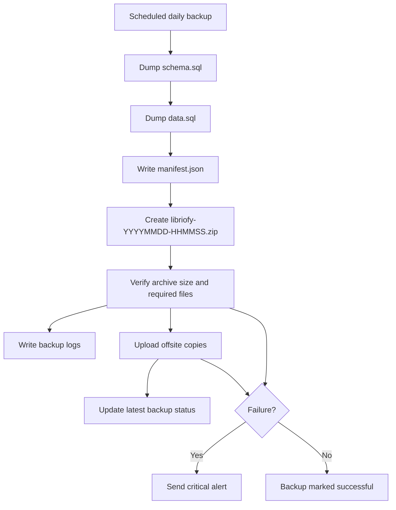
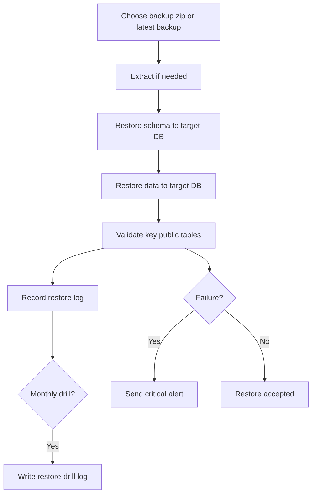

# Backup And Recovery Blueprint

This page explains how Libriofy backup and recovery works as a system, not just as a script.

Detailed operator runbook: [../backup-and-recovery.md](../backup-and-recovery.md)

## Objective

If production fails, recovery should be predictable, repeatable, and understandable by a new operator. The target recovery window is `15-30 minutes`.

## Core Components

| Component | Responsibility | Repo location |
| --- | --- | --- |
| Automated backup job | create daily logical backup bundle | `scripts/backup-db.ps1` |
| Verification layer | confirm archive exists, contains required files, and meets minimum size | `scripts/backup-db.ps1`, `scripts/ops-common.ps1` |
| Offsite replication | copy backup bundle outside local machine | S3, `rclone`, Supabase Storage |
| Restore engine | restore backup bundle into target DB | `scripts/restore-db.ps1` |
| Monthly restore drill | prove staging restore still works | `scripts/run-restore-drill.ps1` |
| Backup health monitor | catch stale or missing backups and drills | `scripts/monitor-backup-health.ps1` |
| Alert transport | send webhook, email, WhatsApp, or SMS alerts | `scripts/send-ops-alert.ps1`, `scripts/ops-common.ps1` |
| Ops status summary | show latest backup, restore, drill, alert, and uptime state | `scripts/ops-health.mjs` |
| Scheduler installer | register recurring automation | `scripts/install-ops-schedule.ps1` |

## Backup Flow

## Restore And Drill Flow

## Automation Cadence

| Automation | Default cadence | Installed by |
| --- | --- | --- |
| Daily backup | every day | `scripts/install-ops-schedule.ps1` |
| Backup health check | every day after backup | `scripts/install-ops-schedule.ps1` |
| Restore drill | monthly | `scripts/install-ops-schedule.ps1` |

## Ownership Model

- default responsible owner: `system-owner`
- override path: `OPS_OWNER_NAME`
- every backup, restore, drill, monitor, and alert record carries the owner name

## Logs And Evidence

The system keeps evidence under `backups/logs/` so recovery does not depend on memory:

- backup history
- latest backup status
- restore history
- restore drill history
- monitor history
- alert delivery history

## Non-Negotiable Rules

- at least one offsite target must be configured in production
- daily backup must pass verification before being considered valid
- staging restore drill must succeed at least once every month
- failures must create both logs and alerts
- `.env.ops` must exist before scheduled automation is installed

## Operator Entry Points

| Need | Command |
| --- | --- |
| run backup now | `npm run backup:db` |
| monitor backup health | `npm run backup:monitor` |
| restore latest backup | `npm run restore:latest` |
| run monthly drill manually | `npm run restore:drill` |
| send a test alert | `npm run ops:alert:test` |
| install scheduled automation | `npm run setup:ops-schedule` |

## Why This Is Production-Grade

The recovery system is now:

- automated, because backup and drill schedules can be installed once
- verifiable, because success requires integrity checks and logs
- monitored, because stale backups and stale drills trigger alerts
- recoverable, because restore is a command, not tribal knowledge
- handover-safe, because ownership, logs, and commands are documented in the repo
