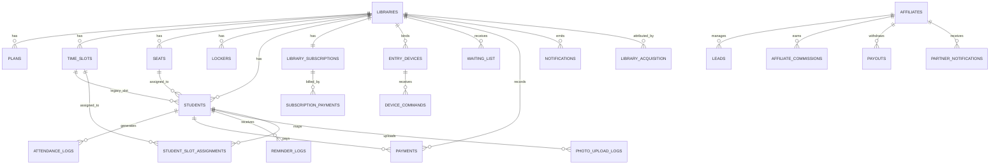

# Database Reference

## Snapshot

- Generated type snapshot: `48` tables, `12` views, `34` typed RPC signatures in `src/integrations/supabase/types.ts`

## Source Of Truth Warning

Use this order of trust when working on the database:

1. `supabase/migrations/*.sql`
2. `src/integrations/supabase/types.ts`
3. frontend assumptions in `src/api/*`, `src/hooks/*`, and `src/pages/*`

For RPC signatures, treat migrations and SQL definitions as the behavioral source of truth and regenerate types when function typing changes are needed.

## Relationship Map

## High-Level Domain Groups

| Domain | Primary tables | What it owns |
| --- | --- | --- |
| Identity and access | `profiles`, `user_roles`, `auth_trusted_devices`, `login_logs` | who can log in and what they can access |
| Library configuration | `libraries`, `plans`, `time_slots`, `seats`, `lockers`, `library_access_keys` | operational setup and public branding |
| Student operations | `students`, `student_slot_assignments`, `attendance_logs`, `payments`, `reminder_logs`, `waiting_list` | the day-to-day library workflow |
| Device operations | `entry_devices`, `device_commands`, `device_setup_attempts` | scanner lifecycle and remote control |
| Billing and SaaS monetization | `library_subscriptions`, `subscription_plans`, `subscription_payments`, `coupons`, `coupon_redemptions` | Libriofy's own subscription billing |
| Partner growth | `affiliates`, `library_acquisition`, `leads`, `affiliate_commissions`, `payouts` | partner attribution, CRM, and payouts |
| Reliability and support | `app_error_logs`, `support_tickets`, `contacts`, `platform_settings`, `photo_upload_logs` | ops, maintenance, support, and troubleshooting |

## Table Catalog

The field lists below focus on the fields that drive application behavior. For the exact typed field list, open `src/integrations/supabase/types.ts` and the latest migration files.

### Identity And Access

| Table | Purpose | Key fields | Main relations |
| --- | --- | --- | --- |
| `profiles` | App-level mirror of Supabase auth user profile info | `user_id`, `full_name`, `email`, `phone_number`, `is_phone_verified`, timestamps | logically linked to `auth.users` |
| `user_roles` | Role mapping for `super_admin`, `library_owner`, `staff`, `partner`, `student` | `user_id`, `role`, `library_id` | used everywhere for authorization |
| `auth_trusted_devices` | Refresh-token and trusted-device registry for custom auth sessions | `user_id`, `refresh_token_hash`, `device_fingerprint_hash`, `login_method`, `delivery_channel`, `expires_at`, `revoked_at`, `session_scope`, `auth_level`, `idle_timeout_seconds` | references `auth.users`; used by auth refresh/logout |
| `login_logs` | Audit trail for password and OTP steps | `user_id`, `email`, `ip_address`, `device`, `login_time`, `status`, `login_step`, `channel`, `reason` | references `auth.users` |
| `user_referrals` | Each user’s referral identity and upstream attribution | `user_id`, `referral_code`, `referred_by`, `created_at` | referral source for `library_acquisition` and rewards |
| `referral_rewards` | Reward records for successful user referrals | `referrer_user_id`, `referred_user_id`, `library_id`, `subscription_payment_id`, `amount`, `status`, `paid_at` | references `libraries`, `subscription_payments` |

### Library Configuration And Public Website

| Table | Purpose | Key fields | Main relations |
| --- | --- | --- | --- |
| `libraries` | Master record for each library and its public website branding | `owner_id`, `name`, `library_name`, `slug`, `custom_domain`, contact fields, hero and CTA fields, colors, `total_seats`, `max_seats`, `total_lockers`, `max_lockers`, `upi_id`, `enabled` | parent for most operational tables |
| `library_access_keys` | Rotatable secure key used to bind scanner devices to a library | `library_id`, `access_key`, `rotated_at`, timestamps | references `libraries` |
| `library_gallery_images` | Public gallery assets for the library website | `library_id`, `image_url`, `caption`, `sort_order` | references `libraries` |
| `library_reviews` | Public testimonials shown on the library website | `library_id`, `reviewer_name`, `review_text`, `rating`, `is_published`, `sort_order` | references `libraries` |
| `domain_requests` | Requested custom domains waiting for admin review | `library_id`, `domain`, `status`, `requested_at`, `reviewed_at`, `review_note` | references `libraries` |
| `platform_settings` | Global key-value operational settings | `key`, `value`, `updated_by`, timestamps | used for maintenance mode and platform switches |
| `plans` | Library-owned student membership plans | `library_id`, `name`, `description`, `duration_hours`, `price`, `is_active` | references `libraries`; used by `students` |
| `time_slots` | Operating time windows and capacity buckets | `library_id`, `name`, `start_time`, `end_time`, `max_seats`, `is_active` | references `libraries`; used by `students` and `student_slot_assignments` |
| `seats` | Physical seat inventory | `library_id`, `seat_index`, `seat_number` | references `libraries`; used by `students` and assignments |
| `lockers` | Physical locker inventory with compatibility fields for older schemas | `library_id`, `locker_number`, `status`, `monthly_price`, `payment_due_date`, `student_id`, `row`, `column`, `col`, `col_position`, `row_position` | tied to library operations; student linkage is stored directly |

### Student Operations

| Table | Purpose | Key fields | Main relations |
| --- | --- | --- | --- |
| `students` | Core student record | `library_id`, `full_name`, `phone`, `email`, `gender`, `plan`, `plan_id`, `seat_id`, `seat_number`, `slot`, `slot_id`, `status`, `start_date`, `expiry_date`, `qr_code`, photo fields, `no_show_days`, `last_check_in` | references `libraries`, `plans`, `seats`, `time_slots` |
| `student_slot_assignments` | Multi-slot mapping for students | `student_id`, `library_id`, `slot_id`, `seat_id`, timestamps | references `students`, `time_slots`, `seats`, `libraries` |
| `attendance_logs` | Check-in / check-out audit per student | `student_id`, `library_id`, `device_id`, `entry_id`, `date`, `check_in`, `check_out` | references `students`, `libraries` |
| `payments` | Student fee ledger and proof workflow | `student_id`, `library_id`, `amount`, `payment_method`, `status`, `source`, `payment_screenshot`, `period_start`, `period_end`, `approved_at`, `approved_by` | references `students`, `libraries` |
| `expenses` | Library expense ledger | `library_id`, `amount`, `category`, `date`, `notes` | references `libraries` |
| `notifications` | Library, student, admin, and delivery notifications | `library_id`, `student_id`, `user_id`, `role`, `type`, `category`, `channel`, `title`, `message`, `delivery_status`, provider fields | references `libraries`, `students` |
| `reminder_logs` | Renewal and reminder delivery attempts | `library_id`, `student_id`, `notification_id`, `reminder_type`, `delivery_channel`, `status`, `phone`, `sent_at`, `error_message` | references `libraries`, `students`, `notifications` |
| `waiting_list` | Leads waiting for seats or admission confirmation | `library_id`, `student_name`, `gender`, `phone`, `email`, `preferred_plan`, `preferred_slot`, `position`, `status`, `notified_at`, `confirmation_deadline`, `confirmed_at`, `aadhaar_photo_path` | references `libraries` |
| `support_tickets` | Support threads from a library workspace | `library_id`, `user_id`, `title`, `description`, `status`, admin reply fields | references `libraries` |
| `photo_upload_logs` | Audit trail for student photo pipeline | `student_id`, `library_id`, temp and final paths, `status`, `error_message`, `uploaded_by`, `uploaded_at` | references `students`, `libraries` |
| `id_card_delivery_jobs` | Async queue for student ID delivery via messaging channels | `student_id`, `library_id`, `status`, `requested_format`, retry fields, last delivery metadata, file fields | references `students`, `libraries` |
| `id_card_delivery_logs` | Delivery attempt history for ID card jobs | `job_id`, `student_id`, `library_id`, `status`, `attempt_number`, delivery provider fields, file fields, `metadata` | references `id_card_delivery_jobs`, `students`, `libraries` |

### Device Operations And Reliability

| Table | Purpose | Key fields | Main relations |
| --- | --- | --- | --- |
| `entry_devices` | Bound kiosk / scanner devices | `library_id`, `device_id`, `device_name`, `is_active`, `secret_token_hash`, `last_seen_at`, `metadata` | references `libraries` |
| `device_commands` | Remote actions sent to bound scanners | `library_id`, `device_id`, `command_type`, `payload`, `status`, timestamps for request/ack/fail/complete, `requested_by`, `requested_by_role`, `metadata`, `error_message` | references `libraries`, `entry_devices` |
| `device_setup_attempts` | Failed setup tracking and temporary lockouts | `device_id`, `attempt_count`, `first_failed_at`, `last_failed_at`, `locked_until`, `last_access_key_suffix` | standalone operational table |
| `app_error_logs` | Frontend and backend failure logging | `route`, `source`, `error_type`, `error_message`, `metadata`, `user_id`, `created_at` | standalone operational table |
| `automated_calls` | Payment recovery IVR / AI calling records | `library_id`, `student_id`, provider fields, call status, pickup status, audio fields, script text, recovery impact fields, callback payload | references `libraries`, `students` |

### Billing And SaaS Monetization

| Table | Purpose | Key fields | Main relations |
| --- | --- | --- | --- |
| `subscription_plans` | Platform-level Libriofy plans sold to libraries | `code`, `name`, `description`, `price`, `seats_limit`, `lockers_limit`, `features`, `is_active`, `sort_order` | standalone catalog |
| `library_subscriptions` | Current active, trial, expired, or blocked subscription state per library | `library_id`, `plan_name`, `plan_type`, `price`, `status`, `payment_status`, `started_at`, `expires_at`, `trial_start_date`, `trial_end_date`, `seats_limit`, `lockers_limit`, feature flags | references `libraries` |
| `subscription_payments` | Razorpay-backed payment records for platform billing | `library_id`, `subscription_id`, `amount`, `currency`, `status`, `months_purchased`, `razorpay_order_id`, `razorpay_payment_id`, `razorpay_signature`, `paid_at`, `metadata` | references `libraries`, `library_subscriptions` |
| `coupons` | Discount codes for subscription checkout | `code`, `discount_type`, `discount_value`, `expires_at`, `max_uses`, `is_active` | referenced by redemptions |
| `coupon_redemptions` | Per-payment coupon reservation or capture state | `coupon_id`, `library_id`, `subscription_payment_id`, `razorpay_order_id`, `discount_amount`, `status`, `user_id` | references `coupons`, `libraries`, `subscription_payments` |
| `library_acquisition` | Attribution record for how a library was acquired | `library_id`, `owner_id`, `referral_code`, `referred_by`, `affiliate_id`, timestamps | references `libraries`, `affiliates` |

### Partner Growth And CRM

| Table | Purpose | Key fields | Main relations |
| --- | --- | --- | --- |
| `affiliates` | Partner profile and payout destination | `user_id`, `name`, `email`, `phone`, `code`, `city`, `experience`, `commission_rate`, `is_active`, `payout_method`, `upi_id`, `bank_details`, totals | partner anchor table |
| `affiliate_commissions` | Commission earned from converted libraries or payments | `affiliate_id`, `library_id`, `subscription_payment_id`, `commission_rate`, `commission_earned`, `status`, `paid_at`, `user_id` | references `affiliates`, `libraries`, `subscription_payments` |
| `leads` | Partner-managed CRM lead pipeline | `partner_id`, `library_id`, `library_name`, `owner_name`, `phone`, `city`, `seats`, `source`, `status`, `expected_value`, follow-up fields, `converted_at`, `auto_whatsapp_sent` | references `affiliates`, optionally `libraries` |
| `partner_lead_notes` | Notes on a lead | `partner_id`, `lead_id`, `note`, `created_at` | references `affiliates`, `leads` |
| `partner_lead_activity` | Activity log on a lead | `partner_id`, `lead_id`, `action_type`, `metadata`, `created_at` | references `affiliates`, `leads` |
| `partner_notifications` | Partner-facing alerts and reminders | `partner_id`, `user_id`, `type`, `title`, `message`, `scheduled_at`, `read`, `metadata` | references `affiliates` |
| `partner_referral_clicks` | Referral landing click tracking | `partner_id`, `referral_code`, `ip_address`, `user_agent`, `created_at` | references `affiliates` |
| `payouts` | Requested and approved partner withdrawals | `partner_id`, `amount`, `status`, `payout_method`, `payout_destination`, `requested_at`, `approved_at`, `paid_at`, `note` | references `affiliates` |

### Public Inboxes And Miscellaneous

| Table | Purpose | Key fields | Main relations |
| --- | --- | --- | --- |
| `contacts` | Website contact-form submissions | `name`, `email`, `phone`, `message`, `created_at` | standalone |

## Views

| View | Purpose |
| --- | --- |
| `admin_affiliate_dashboard` | Aggregated partner metrics used across admin and partner dashboards |
| `admin_coupon_dashboard` | Coupon usage and status rollup for super admin |
| `admin_state_analytics` | Library distribution by state |
| `admin_district_analytics` | Library distribution by district |
| `admin_city_analytics` | Library distribution by city |
| `admin_platform_coverage` | Platform spread / coverage summary |
| `recovery_queue` | Per-student payment recovery prioritization view |
| `attendance` | Compatibility / reporting view for attendance |
| `commissions` | Compatibility / reporting view for partner commissions |
| `partners` | Compatibility / reporting view for affiliate partner data |
| `subscriptions` | Compatibility / reporting view for library subscriptions |
| `users` | Compatibility / reporting view for auth-linked user data |

## RPC / Function Inventory

### Public Discovery And Admission

- `get_library_public`
- `get_slot_availability`
- `add_to_waiting_list`
- `confirm_waiting_list`
- `process_waiting_list_timeouts`
- `notify_next_in_queue`

### Attendance, QR, Renewal, And Student Lifecycle

- `qr_check_in`
- `scan_attendance_entry`
- `get_student_renewal_context`
- `renew_student`
- `submit_renewal_payment`
- `process_renewals`
- `process_locker_renewals`
- `run_renewal_reminder_scan`
- `trigger_daily_renewal_reminder_scan`
- `detect_no_shows`
- `prepare_student_photo_upload`
- `update_student_photo_url`
- `derive_student_original_photo_path`
- `extract_student_photo_path_from_url`
- `log_student_photo_upload_failure`
- `trigger_student_photo_cleanup`

### Capacity And Mapping

- `assign_locker`
- `release_locker`
- `sync_library_lockers`
- `sync_library_seats`
- `library_locker_plan_limit`
- `library_seat_plan_limit`
- `seat_label_from_index`
- `locker_label_from_index`
- `normalize_seat_number`
- `slot_lookup_matches`
- `format_compact_time`

### Access Control And Device Security

- `can_access_library`
- `user_can_access_library`
- `has_role`
- `validate_and_bind_scanner_device`
- `regenerate_library_access_key`
- `issue_device_command`
- `pull_device_commands`
- `record_device_command_status`

### Notifications And Admin Messaging

- `notification_category_for_event`
- `notify_library_users`
- `notify_super_admins`

### Partner, Referral, And Admin Finance

- `generate_partner_code`
- `generate_affiliate_code`
- `generate_referral_code`
- `get_partner_leaderboard`
- `request_partner_payout`
- `admin_approve_partner_payout`
- `admin_mark_partner_payout_paid`
- `recalculate_affiliate_totals`

### Utility And Helper Functions

- `normalize_lookup_text`
