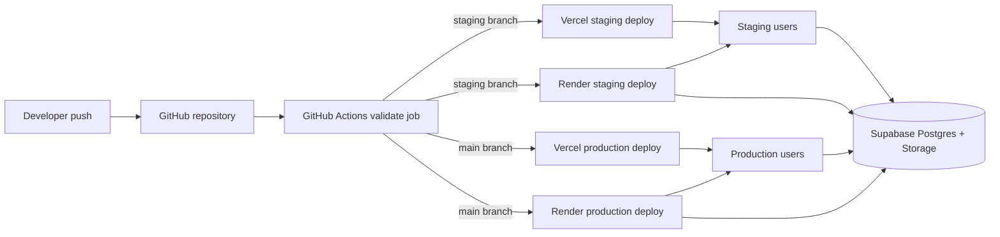
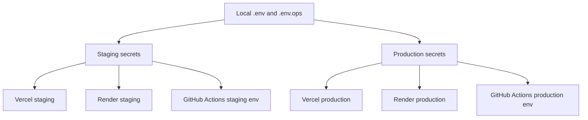

# DevOps And Infra Blueprint

This page explains Libriofy deployment and operations as a system design, not only as a list of platform settings.

Detailed operator runbook: [../devops-and-infra.md](../devops-and-infra.md)

## Objective

Deployment, monitoring, and recovery should be predictable even if the current developer changes. The system must stay operable through documented platforms, health checks, and automation.

## Deployment Topology

## Runtime Responsibilities

| Layer | Responsibility | Repo source |
| --- | --- | --- |
| Frontend CDN | serve SPA, cached assets, HTTPS termination | `vercel.json` |
| API runtime | auth, scanner routes, health endpoints, AI helper, static fallback | `server/index.ts`, `Dockerfile.api`, `render.yaml` |
| Database platform | durable data, migrations, RPCs, storage, Edge Functions | `supabase/migrations/`, `supabase/functions/` |
| CI/CD | validation, deploy orchestration, failure alerts | `.github/workflows/ci-cd.yml` |
| Uptime monitoring | scheduled endpoint checks and alerting | `.github/workflows/uptime-monitor.yml`, `scripts/ops-health.mjs` |
| Backup and restore | backup, verification, drill, alert logs | `scripts/`, `docs/backup-and-recovery.md` |
| Error observability | client and server error capture | `src/lib/observability/` |

## Environment Model

Rules:

- browser-safe config belongs only in `VITE_*`
- server-only secrets stay out of browser builds
- `.env.example` and `.env.ops.example` must document every required variable
- staging and production remain separate at branch, domain, and host level

## Reliability Controls

| Control | Why it exists |
| --- | --- |
| docs coverage check | blocks undocumented feature or infra changes |
| `/health/ready` | stable platform readiness probe |
| `x-request-id` | correlates incidents across logs and alerts |
| Sentry client and server setup | catches runtime failures outside local logs |
| `ops:health` summary command | gives one-command system status |
| scheduled uptime monitor | catches silent production or staging outages |
| monthly restore drill | proves backups are usable |

## Performance Baseline

Libriofy currently relies on:

- CDN asset delivery
- immutable asset caching
- Express compression
- split API and frontend runtimes
- managed Supabase database services

This is the baseline for the initial `1000+` user target. Larger growth should add queue isolation, cache layers, and deeper chunk splitting.

## Handover-Safe Operating Principle

The system is considered handover-safe only when:

- the deployment path is encoded in repo config
- required secrets are documented
- health endpoints and alerts are active
- backups and restore drills are visible through logs
- a new developer can follow the docs without guessing hidden setup

## Go-Live Rule

Production release is not approved until `npm run go-live:check` passes.

No exceptions:

- failed checks invalidate release
- if it cannot be verified, it is not deployed
- manual checks without evidence invalidate release
- release SHA mismatch between verified version and deployed version invalidates release
- unreproducible builds are not trusted
- unmonitored services are treated as already broken

Use `npm run go-live:report` when another system needs the machine-readable `release_truth` verdict.
