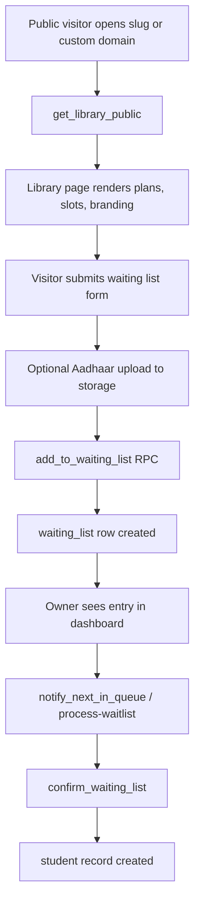
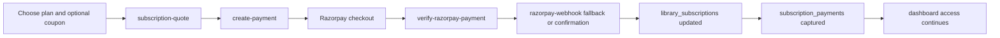

# Feature Flows

This document explains the main business journeys in the format:

- input
- backend process
- database writes or reads
- output

## 1. Library Owner Signup And Bootstrap

**Input**

- email
- password
- full name
- phone number
- optional referral code / affiliate code

**Backend process**

- `useAuth.signUp()` calls `supabase.auth.signUp()`.
- User metadata carries `full_name`, `phone_number`, `account_type`, `referral_code`, `affiliate_code`, and partner-only payout fields.
- Database-side signup triggers defined in migrations bootstrap the application records for the new account.

**Database writes**

- `auth.users`
- `profiles`
- `libraries` for the default library
- `user_roles` with `library_owner`
- `user_referrals`
- optional `library_acquisition` when a referral or affiliate attribution exists

**Output**

- a confirmed or pending-confirmation account
- a default library workspace
- dashboard-ready ownership mapping

## 2. Login With OTP Or Email

```mermaid
flowchart LR
  A[Phone or email input] --> B[/auth/send-otp or /auth/login-email]
  B --> C[otpAuth.server]
  C --> D[profiles + user_roles lookup]
  C --> E[OTP delivery or password verification]
  E --> F[auth_trusted_devices + login_logs]
  F --> G[ClientAuthSession + refresh cookie]
  G --> H[ProtectedRoute redirect]
```

**Input**

- phone number for OTP login, or email and password for direct login
- device fingerprint and device label headers

**Backend process**

- `POST /auth/send-otp` normalizes the phone, rate-limits the request, resolves the user from profile data, hashes the OTP, and sends it through WhatsApp or SMS.
- `POST /auth/verify-otp` validates the OTP, creates an access token, issues the refresh cookie, and records the trusted device.
- `POST /auth/login-email` verifies the password and creates the same session envelope for email login.
- `useAuth` stores the session in browser storage and schedules refresh / inactivity handling.

**Database writes**

- `auth_trusted_devices` from migrations
- `login_logs` from migrations

**Database reads**

- `profiles`
- `user_roles`

**Output**

- `ClientAuthSession`
- refresh cookie `libriofy_refresh`
- redirect to `/dashboard`, `/partner/dashboard`, or `/admin/dashboard` depending on role

## 3. Super Admin Login With MFA

**Input**

- super admin email
- password
- second-factor OTP

**Backend process**

- `POST /auth/super-admin/login` verifies the password through `super_admin_verify_password`.
- The server creates a challenge and sends OTP via email or WhatsApp.
- `POST /auth/super-admin/verify-otp` validates the challenge and upgrades the session to `session_scope = super_admin` with `auth_level = 2`.
- Super admin sessions use a shorter idle timeout.

**Database writes**

- `login_logs`
- `auth_trusted_devices` with super-admin session metadata

**Output**

- MFA-validated admin session
- access to `/admin/*`

## 4. Public Library Page To Waiting List



**Input**

- slug or custom domain
- name, gender, phone, email
- preferred plan and slot
- optional Aadhaar image

**Backend process**

- `DomainRouter` detects custom domains and loads the public library page.
- The page loads library branding through `get_library_public`.
- Active plans and slots are read from `plans` and `time_slots`.
- Slot occupancy is fetched through `get_slot_availability`.
- Form submission optionally uploads Aadhaar to storage, then calls `add_to_waiting_list`.
- Library staff later review, notify, and confirm entries from the dashboard using waitlist flows and `confirm_waiting_list`.

**Database writes**

- `waiting_list`
- student document storage path for Aadhaar

**Output**

- queue position for the visitor
- visible waiting list item in the owner dashboard
- later promotion into a real `students` row when confirmed

## 5. Add Student And Assign Plan / Seat / Slot

**Input**

- student profile details
- plan selection
- seat selection
- one or more slot selections
- start date and expiry date
- optional photo upload trigger

**Backend process**

- `AddStudentDialog` loads active `plans`, `time_slots`, `seats`, and current students to validate conflicts.
- The dialog inserts the base `students` row.
- When multi-slot support is available, it also writes `student_slot_assignments`.
- Optional photo upload runs after student creation through the photo pipeline.

**Database writes**

- `students`
- `student_slot_assignments`
- optional `photo_upload_logs`

**Output**

- an active student record usable everywhere else in the system
- visible student row in dashboard, QR page, payments, renewals, and attendance

## 6. Student Photo Upload And Signed QR Generation

**Input**

- student id
- selected photo file
- library id for QR generation

**Backend process**

- Photo flow compresses the image, prepares final file paths through `prepare_student_photo_upload`, uploads final assets, then finalizes with `update_student_photo_url`.
- The code supports a client fallback when Edge Function finalization is unavailable.
- QR flow calls `/api/student-qr` with an access token.
- The server verifies the requester can access the library, loads the student row, signs a token with `STUDENT_QR_PRIVATE_KEY`, and returns expiring claims.
- `QRCodesPage` builds branded ID cards and can export PNG, PDF, or ZIP bundles.

**Database writes**

- `students.photo_url`, `photo_storage_path`, `photo_thumbnail_path`, `photo_version`
- `photo_upload_logs`
- optional future ID delivery rows in `id_card_delivery_jobs` and `id_card_delivery_logs`

**Output**

- public student photo URLs
- signed student QR token
- printable or shareable ID card assets

## 7. Device Setup, Heartbeat, And Attendance Scan

```mermaid
flowchart TD
  A[Open /setup-device] --> B[Enter Library Access Key]
  B --> C[validate_and_bind_scanner_device]
  C --> D[entry_devices updated]
  D --> E[Binding saved in localStorage]
  E --> F[/scan scanner page]
  F --> G[Scan QR]
  G --> H{Network available?}
  H -- Yes --> I[/api/attendance/scan]
  I --> J[Device validation + QR signature validation]
  J --> K[scan_attendance_entry / qr_check_in]
  K --> L[attendance_logs]
  H -- No --> M[IndexedDB offline queue]
  M --> N[Background sync]
  N --> I
```

**Input**

- library access key
- device id, device token, device name
- scanned QR payload
- generated `entry_id` and timestamp

**Backend process**

- Setup validates the access key and binds the device to a `library_id`.
- The binding is stored both server-side in `entry_devices` and client-side in local storage.
- Every attendance scan validates:
  - device binding
  - library access key
  - optional device token
  - signed QR token or legacy QR format
  - student and library match
- The server then calls `scan_attendance_entry` and falls back to `qr_check_in` for compatibility.
- If the network is unavailable, the scan is queued in IndexedDB and later replayed.

**Current implementation note**

- The live `/scan` route is [src/pages/ScanPage.tsx](../../src/pages/ScanPage.tsx).
- The scanner now uses a worker-based hybrid pipeline: `BarcodeDetector` first, `jsQR` fallback, cropped ROI processing, adaptive frame pacing, and device-tier-aware ROI / camera-profile tuning.
- Device heartbeat, duplicate prevention, offline-verified queueing, soft watchdog recovery, and scanner debug logging are part of the live `/scan` route.
- Real-device benchmarking is built in through `window.__LIBRIOFY_SCAN_METRICS__` and the optional `/scan?scanDebug=1` overlay.

**Database writes**

- `entry_devices`
- `device_setup_attempts`
- `attendance_logs`
- `app_error_logs` for exceptional failures
- `device_commands` state changes when remote control is used

**Output**

- `check-in` or `check-out` result
- duplicate-scan safety
- offline queued result if connectivity fails
- live dashboard updates for attendance and device health

## 8. Renewal Payment Through Public Link

**Input**

- renewal token from `/renew/:token`
- screenshot of UPI payment proof

**Backend process**

- `get_student_renewal_context` resolves the student, library, plan, amount, seat, and UPI id.
- The student pays outside the platform using the generated UPI QR or link.
- The screenshot is uploaded to storage.
- `submit_renewal_payment` records the payment proof for approval.
- Library staff later review and approve the payment inside the dashboard.
- Reminder automation continues through `process-renewals` and `reminder_logs` until resolution.

**Database writes**

- payment screenshot storage path
- `payments`
- `reminder_logs`
- `notifications`

**Output**

- public status badge: awaiting proof, pending verification, or approved
- once approved, the student remains active and the renewal timeline updates

## 9. Platform Subscription Billing



**Input**

- library id
- selected plan
- months
- optional coupon code

**Backend process**

- `subscription-quote` calculates current pricing, discounts, and eligibility.
- `create-payment` creates the Razorpay order.
- The browser opens Razorpay checkout.
- `verify-razorpay-payment` confirms the payment immediately.
- `razorpay-webhook` acts as an asynchronous fallback / source of final confirmation.
- The system updates subscription status and associated payment records.
- Referral and affiliate logic may create `coupon_redemptions`, `affiliate_commissions`, and `referral_rewards`.

**Database writes**

- `library_subscriptions`
- `subscription_payments`
- optional `coupon_redemptions`
- optional `affiliate_commissions`
- optional `referral_rewards`

**Output**

- active or renewed platform subscription
- seat and locker limit enforcement
- uninterrupted dashboard access

## 10. Partner Signup, Lead Tracking, And Payouts

**Input**

- partner registration data
- payout details
- lead records
- payout request amount

**Backend process**

- Partner registration uses `signUp()` with `account_type = partner`.
- Database bootstrap creates or updates the `affiliates` record and assigns the `partner` role.
- Referral landing captures clicks into `partner_referral_clicks`.
- Partners manage their CRM through the `leads` table and supporting note/activity tables.
- When referred libraries convert into paid subscriptions, commission logic updates affiliate totals.
- Partners request withdrawals through `request_partner_payout`.

**Database writes**

- `affiliates`
- `partner_referral_clicks`
- `leads`
- `partner_lead_notes`
- `partner_lead_activity`
- `partner_notifications`
- `affiliate_commissions`
- `payouts`

**Output**

- partner dashboard metrics
- commission balances
- payout lifecycle from pending to approved to paid

## 11. Remote Device Control

**Input**

- owner command: disable, refresh, logout, or similar

**Backend process**

- `DeviceControlCenter` issues commands through `issue_device_command`.
- The kiosk polls `pull_device_commands` and processes the latest pending actions.
- Execution status is reported back through `record_device_command_status`.
- Device metadata is also updated in `entry_devices.metadata.device_control`.

**Database writes**

- `device_commands`
- `entry_devices`

**Output**

- near-real-time command visibility in the owner dashboard
- controlled device shutdown, logout, or recovery without touching the kiosk directly
