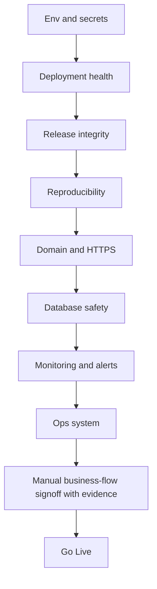

# Go-Live Checklist Blueprint

Detailed operator runbook: [../go-live-checklist.md](../go-live-checklist.md)

## Objective

Go-live should be a system decision, not a memory-based decision. Libriofy now treats release readiness as a checklist with automated and manual gates.

## Release Gate Model

## Release Truth Signals

`scripts/go-live-check.mjs` also emits a top-level `release_truth` summary so another developer or automation system does not need to infer readiness from raw checks.

| Truth signal | Derived from |
| --- | --- |
| `verified` | Deployment, Release Integrity, Domain & HTTPS, Database Safety, Final Test |
| `reproducible` | Reproducibility |
| `monitored` | Monitoring, Ops System |

## Automated Gates

| Gate | Source |
| --- | --- |
| env validation | `scripts/go-live-check.mjs`, `src/lib/observability/startupValidation.ts` |
| staging and production endpoint health | `scripts/go-live-check.mjs`, `scripts/ops-health.mjs` |
| reproducible build proof | `scripts/go-live-check.mjs`, `package-lock.json`, `.github/workflows/ci-cd.yml`, `dist/`, `dist-server/` |
| production database connectivity | `/health/ready` via `src/lib/observability/serverHealth.ts` |
| verified release matching | `scripts/go-live-check.mjs`, frontend `/release.json`, API `/health` |
| backup freshness | backup status logs |
| restore drill freshness | restore drill logs |
| alert test presence | alert status logs |
| scheduled backup task presence | Windows Task Scheduler query in `scripts/go-live-check.mjs` |

## Manual Gates

| Gate | Why it stays manual |
| --- | --- |
| login works | requires real auth path validation |
| QR scan works | requires real kiosk or realistic scan validation |
| payment works | requires end-to-end provider verification |

Manual signoff is recorded through `.ops/go-live-manual-checks.json` and is only valid when evidence and release SHA are present.

## Rule

If `npm run go-live:check` fails, release readiness is `fail`.

Use `npm run go-live:init` to create the local manual signoff file from the committed example template.

Use `npm run release:truth` when you want the rebuild-plus-gate version of the same rule.

Use `npm run go-live:report` when you want the JSON report and `release_truth` summary for another system.
